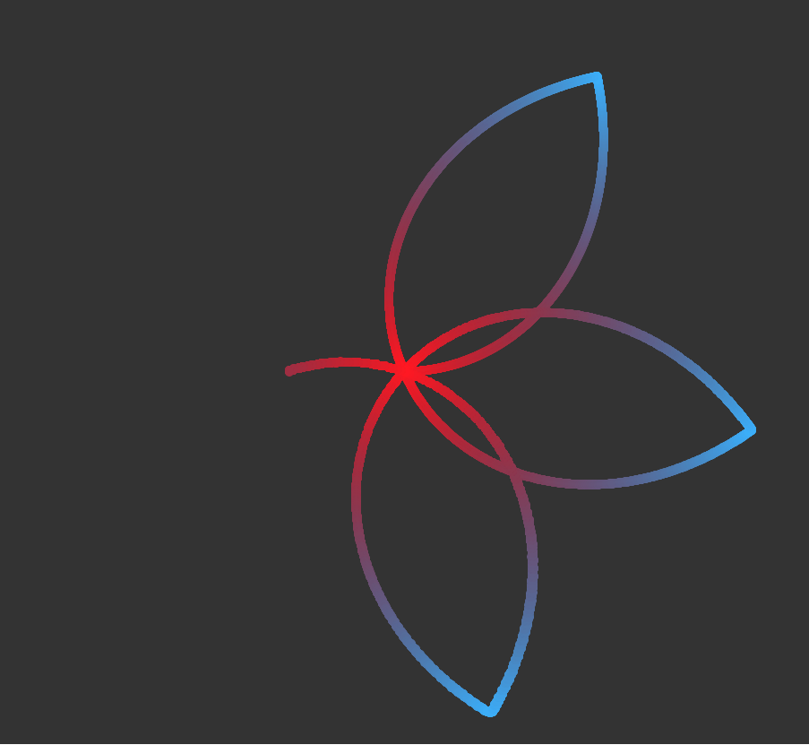

# flower

A simulation of wave-like patterns with different speeds that make for a
beautiful rotating and expanding flower.

Done with WASM and Rust, with the support of `wasm-bindgen`, `cargo-generate`
and all the tools from the RustWASM Team. Much appreciated!

The simulation first calculates all the colors it will use and makes all the
canvases it needs to make up for all the images it will blit. The JavaScript is
responsible for requesting animation frames, calling the Rust code to update the
state and the color indices and updating the canvas screen so that we can see
the simulation. The Rust code is responsible for all computations, like color
computation, which image corresponds to each ball, and updating the positions
every frame, making sure they don't go off.

# Building and running

Make sure you have installed:
    - `wasm-pack` [link to download website](https://rustwasm.github.io/wasm-pack/)
    - `npm` [link to download website](https://docs.npmjs.com/downloading-and-installing-node-js-and-npm). I'm using node version `18.12.1` with npm `8.19.2`, if anything fails when trying to start the server you could remove possibilities by using these versions.

Now go to the root directory and run `wasm-pack build`, then go to `www` folder
and run `npm start`. This will start a server on localhost, copy the address and
paste it into your browser! The main javascript file is `www/index.js` and
everything Rust is `src/lib.rs`. Have fun!

# Screenshot

